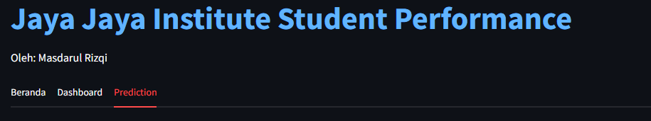

# Proyek Akhir: Menyelesaikan Permasalahan Perusahaan Edutech

## Business Understanding
Jaya Jaya Institut merupakan salah satu institusi pendidikan perguruan yang telah berdiri sejak tahun 2000. Hingga saat ini ia telah mencetak banyak lulusan dengan reputasi yang sangat baik. Akan tetapi, terdapat banyak juga siswa yang tidak menyelesaikan pendidikannya alias dropout.

Jumlah dropout yang tinggi ini tentunya menjadi salah satu masalah yang besar untuk sebuah institusi pendidikan. Oleh karena itu, Jaya Jaya Institut ingin mendeteksi secepat mungkin siswa yang mungkin akan melakukan dropout sehingga dapat diberi bimbingan khusus.


### Permasalahan Bisnis
*   Atribut mana yang paling berhubungan dengan status mahasiswa
*   Seberapa besar dropout rate dan graduation rate secara keseluruhan
*   Bagaimana hubungan penerima mahasiswa dengan status mahasiswa
*   Bagaimana nilai masuk memengaruhi status mahasiswa
*   Bagaimana cara mengidentifikasi mahasiswa yang akan melakukan dropout


### Cakupan Proyek
1.  Menganalisis faktor penyebab tingginya dropout rate
2.  Membuat model machine learning dan prediksi sederhana dan di-deploy pada streamlit
3.  Membangun dashboard menggunakan streamlit

### Persiapan

Sumber data: [students' performance.](https://github.com/dicodingacademy/dicoding_dataset/blob/main/students_performance/data.csv)

Setup environment:
```
streamlit==1.38.0
joblib==1.3.2
pandas==2.2.2
plotly==5.21.0
seaborn==0.13.2
matplotlib==3.8.2
```

## Business Dashboard


Pada bagian atas dashboard, terdapat empat slicer yang bertujuan untuk membantu pengguna menfilter sesuai kebutuhan. Slicer tersebut terdiri dari sebagai berikut.
1.  Status - terdiri dari "Dropout", "Enrolled", dan "Graduated".
2.  Course/Jurusan - terdiri dari jurusan yang ada. Hanya dapat memilih satu jurusan dalam satu waktu.
3.  Attendance Time/Tipe jurusan - terdiri dari daytime (kelas pagi) dan evening (kelas malam).
4.  Gender - terdiri dari "Male" dan "Female".

Di bagian bawah judul terdapat keterangan atau card yang terdiri dari dropout rate dan jumlah siswa yang ada. Keterangan tersebut bersifat dinamis dan berubah sesuai filter yang digunakan. Di bawah keterangan tersebut, terdapat lima grafik.
1.  Diagram Pie penerima beasiswa (scholarship holder) berdasarkan status.
2.  Diagram batang rata-rata nilai semester 1 dan semester 2. Terdapat selisih dan persentase dari semester 1 ke semester 2.
3.  Diagram batang jumlah siswa berdasarkan jenis kelamin (gender) untuk memberikan gambaran tentang komposisi gender di institut.
4.  Diagram batang dropout siswa berdasarkan program studi untuk mengidentifikasi program studi mana yang memiliki masalah dropout lebih tinggi
5.  Diagram batang jumlah siswa berdasarkan waktu kehadiran mereka (daytime atau evening) untuk memberikan gambaran tentang preferensi waktu kuliah siswa.

[Dashbord](https://7zvlmyqrhtbbpidmlw6zuj.streamlit.app/)
## Menjalankan Sistem Machine Learning
Langkah-langkah menggunakan sistem machine learning berbasis random forest adalah sebagai berikut.
1.  Membuka link https://7zvlmyqrhtbbpidmlw6zuj.streamlit.app/
2.  Memilih "Prediction"<br>

3.  Mengisi data yang dibutuhkan. Perlu diperhatikan bahwa nilai jurusan atau Course tidak boleh 'None' serta terdapat batas minimum dan maksimum pada input numerik. Selain itu, pengguna harus menekan enter agar dapat menyimpan data numerik.<br>


```

```

## Conclusion
Jelaskan konklusi dari proyek yang dikerjakan.

### Rekomendasi Action Items
Berikan beberapa rekomendasi action items yang harus dilakukan perusahaan guna menyelesaikan permasalahan atau mencapai target mereka.
- action item 1
- action item 2
